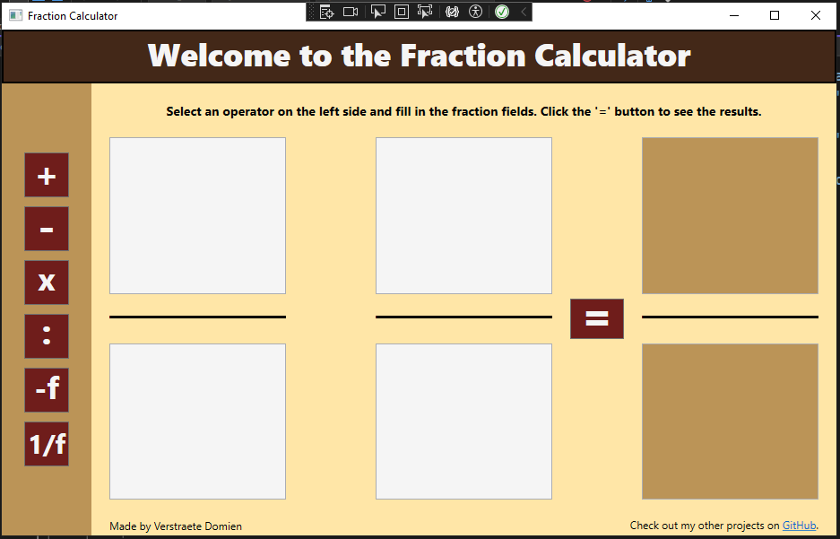
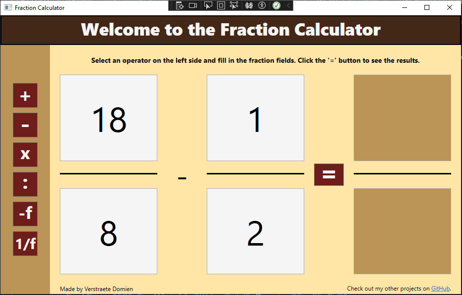
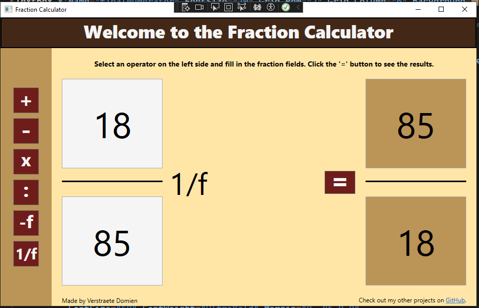
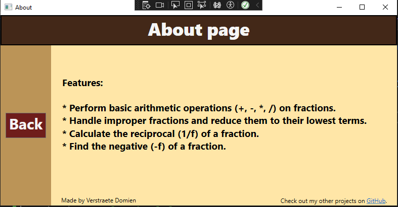
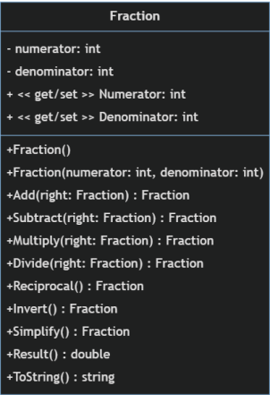

# Fraction-Calculator

This is a C# project implementing a fraction calculator. It allows users to perform basic arithmetic operations (+, -, *, /, -f, 1/f) on fractions.

## Features
Performs addition, subtraction, multiplication, division , invers and reciprocal of fractions.
Handles improper fractions and reduces fractions to their lowest terms.
Provides a user-friendly interface.

## requirements
Visual studio

## Author
BelgianWaffleCorp 

Student @ vives Brugge

## Run the application.
Enter the numerator and denominator for each fraction in the designated fields.
Select the desired operation (+, -, *, /, -f, 1/f).
Click the "=" button to perform the operation.
The result will be displayed in a designated area.

## Screenshots
### Main window

### Multiply

### Result clears
Changing the operator auto clears the result.

### Inverse

### about
The about button was added later on.

you can find the about button in the top left corner.

### UML diagram

## xUnit tests
- test if there is an numerator, denominator and operator.
- test if the denominator is not zero.
- test for all the different operators with positive and negative numbers.
- test the result and ToString methodes.

## Future Improvements:
- Being able to add more fractions.
- Theme options for the user.
- Adding rounded corners.
- Better responsive design.

## License

[MIT](https://choosealicense.com/licenses/mit/)
